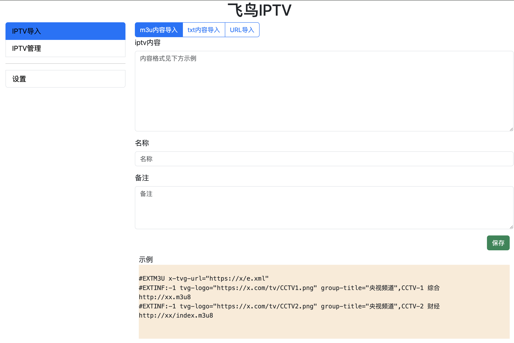
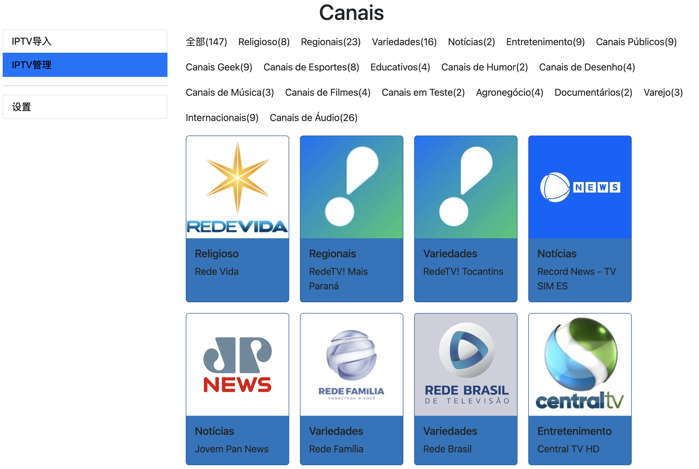
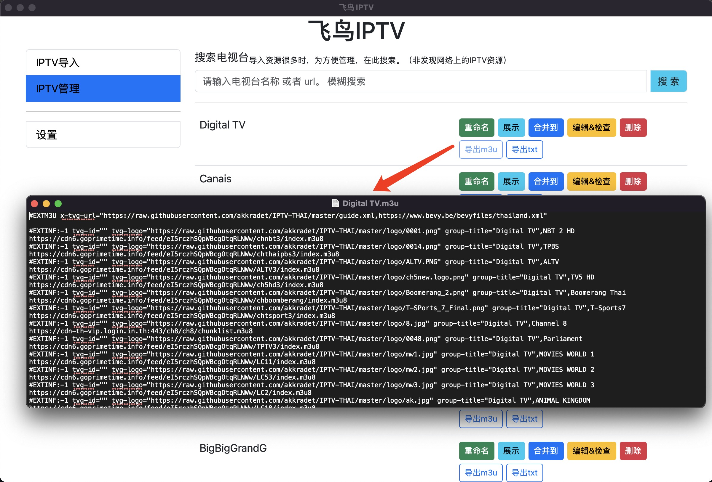
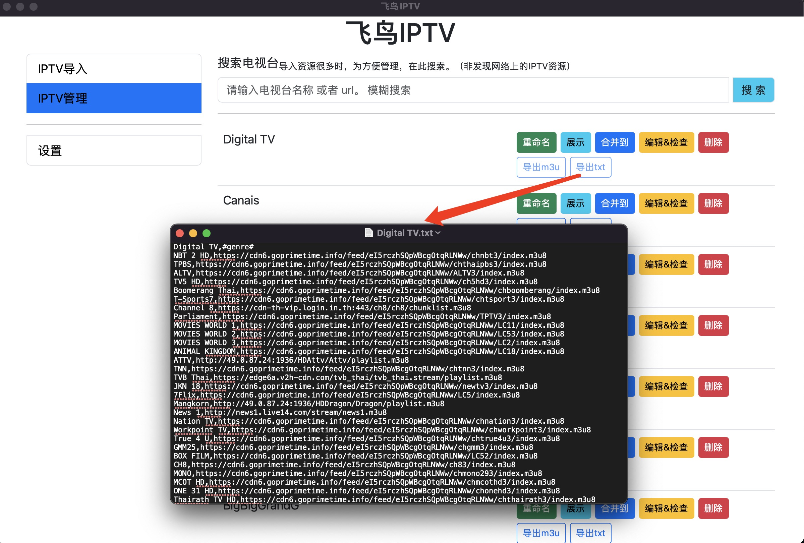

# flybird-iptv
flybird-iptv 是一款全新的 IPTV 质量检测工具。 可深度检测tv视频加载、播放速度。  

功能列表
 - iptv管理: 增删改查tv、合并移动tv, m3u和txt格式导入导出互相转换
 - iptv播放质量检测
 - 配置代理 播放、检测 直连网络不可访问tv
 - PC本地播放TV

**软件亮点：检测 tv m3u8 index 索引文件加载耗时， 检测 m3u8 ts 视频加载耗时**

## 系统支持
 - Windows10+
 - MacOS

## 下载地址
[https://github.com/zhengxiaopeng/flybird-iptv/releases](https://github.com/zhengxiaopeng/flybird-iptv/releases)

## 领取激活码
微信扫一扫 免费领取激活码
  

<!-- ## 使用教程
[https://www.bilibili.com/video/BV17K4y1x77E/](https://www.bilibili.com/video/BV17K4y1x77E/) -->

## 界面预览图
导入iptv
   

管理iptv
   

查看播放
    

检查是否有效
  

导出m3u
  

导出txt
   

## QQ交流群
QQ交流群： 854313352  

  

<a href="https://qm.qq.com/q/3pz7V9BHJu">点击链接加入群聊【就是玩群】：https://qm.qq.com/q/3pz7V9BHJu</a>

